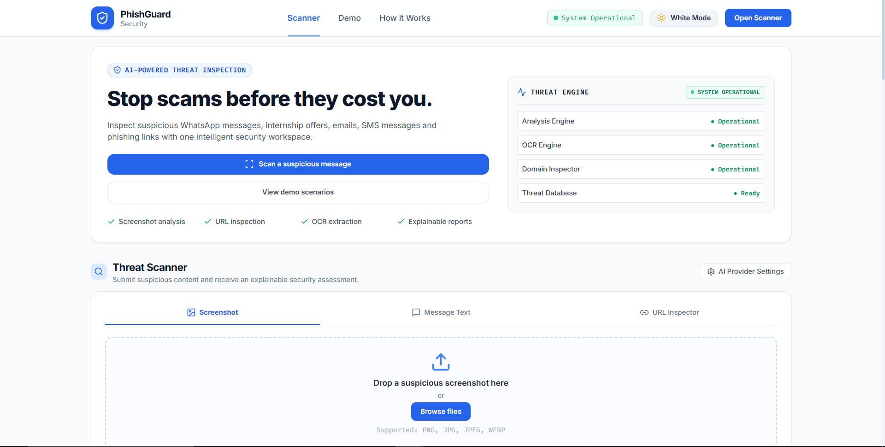
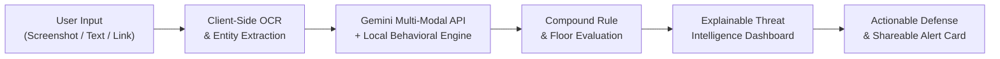

# PhishGuard AI 🛡️
> **Autonomous Real-Time Threat Intelligence & Multimodal Scam Defense Platform**  
> *Open Innovation Hackathon 2026 • AI & Cybersecurity Track*

[](https://hack-wliq.vercel.app/)
[](https://opensource.org/licenses/MIT)

---

## 🌐 Quick Access
* **Live Web Application:** [https://hack-wliq.vercel.app/](https://hack-wliq.vercel.app/)

---

## 📸 Platform Interface Showcase



---

## 🎯 The Problem
Modern cyber threats are no longer crude, misspelled emails that spam filters can catch. Attackers have pivoted to **high-context, psychologically tuned social engineering**:
- **Campus & Internship Recruitment Scams:** Fraudulent offers impersonating MNCs (Meta, Microsoft, Cisco) and demanding upfront "refundable onboarding/registration fees".
- **Account Disconnection & Urgency Traps:** Fake warnings claiming an application is "on hold" or power supply is "scheduled for cutoff", directing users to spoofed `/login` credential-harvesting pages.
- **Reverse Social Engineering (Fake Debit Alerts):** Unsolicited transaction debit SMS alerts containing 10-digit private dispute numbers designed to induce panic callbacks.
- **Mobile-First Infiltration:** Threats bypassing corporate gateways via WhatsApp forwards, Telegram groups, and screenshot captures.

---

## 💡 The Solution: PhishGuard AI
**PhishGuard AI** is an autonomous, explainable cybersecurity workspace designed to protect students and everyday users before they click, pay, or disclose credentials.

### ✨ Core Capabilities
1. **Multimodal Tri-Channel Intake:**
   - 📸 **Screenshot Vision OCR:** Upload or drag & drop screenshots of chat conversations, emails, or fake offer letters with client-side OCR extraction (powered by Tesseract.js).
   - 💬 **Message Text Analysis:** Deep semantic inspection of pasted SMS, WhatsApp, and email bodies.
   - 🔗 **URL & Domain Inspector:** Analyzes typosquatting, suspicious TLDs (`.xyz`, `.top`, `.online`), URL shorteners (`bit.ly`), and credential harvesting paths (`/login`, `/verify`).
2. **Transparent Multi-Signal Behavioral Risk Scoring:**
   - Calculates a 0–100 risk score based on **weighted behavioral indicators** (identity, urgency, credential harvesting, upfront fees, brand spoofing).
   - **Explainable Evidence Cards:** Highlights the exact excerpt and psychological trick rather than giving a black-box verdict.
3. **Compound Rule Safety Engine:**
   - Enforces minimum risk floors on dangerous combinations (e.g. Job Offer + Credential URL = 88+ Critical).
   - **False-Positive Prevention:** Accurately distinguishes genuine automated bank transaction debit notifications (with 12-digit UPI reference IDs) from malicious lures.
4. **Actionable Defense Guidance:**
   - Generates immediate 1-click countermeasures ("Do NOT pay deposit", "Verify on official student portal", "Report to 1930 / cybercrime.gov.in").
   - **1-Click WhatsApp Warning Card:** Export and share alerts with classmates or family groups.
5. **Interactive Judge Demo Hub:**
   - Pre-loaded benchmark scenarios (Campus Internship Scam, Fake Bank Alert, Genuine Transaction) for 1-click demonstration.

---

## 🏗️ Architecture & Tech Stack



* **Frontend:** React 18, Vite, Tailwind CSS (Tailored Ambient Light & Cyber Glassmorphism Dark Mode), Lucide React Icons.
* **AI & Detection Engine:** Google Gemini 2.0 / 1.5 Flash API + Local Behavioral Fallback Risk Engine (`riskEngine.js`).
* **OCR & Vision:** Client-Side Tesseract.js (zero server storage).

---

## 🚀 Getting Started Locally

### Prerequisites
* **Node.js**: v18.0.0 or higher
* **npm**: v9.0.0 or higher

### Installation & Run
```bash
# 1. Clone the repository
git clone https://github.com/Jitesh-bash/hack.git

# 2. Navigate to project directory
cd hack

# 3. Install project dependencies
npm install

# 4. Launch development server
npm run dev
```

The application will start locally at `http://localhost:3000/`.

---

## 🛡️ Privacy Guarantee
* **100% Client-Side Inspection:** User chat screenshots and messages are processed ephemerally in browser memory and are never persisted to a database.
* **Zero Third-Party Tracking.**

---

## 👥 Team & Hackathon Submission
* **Project:** PhishGuard AI
* **Hackathon:** Open Innovation Hackathon 2026
* **Track:** AI & Cybersecurity
* **Live Deployment:** [https://hack-wliq.vercel.app/](https://hack-wliq.vercel.app/)
