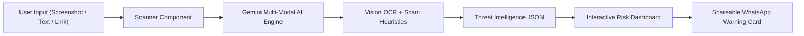

# PhishGuard AI 🛡️
> **Real-Time Multi-Modal AI Scam, Phishing & Fake Job Offer Intelligence Platform**  
> *Built for Hack Devengers 2.0 (Open Innovation Track)*


---

## 🎯 The Problem
Every month, millions of students, job seekers, and digital users fall victim to **WhatsApp scams, fake internship offers demanding registration fees, SMS utility disconnection threats, and spoofed banking phishing URLs**.

Common victims are students who don't know how to spot typosquatted domains or upfront payment job traps. Existing antivirus software only checks desktop malware, leaving social engineering scams unchecked.

---

## 💡 The Solution: PhishGuard AI
**PhishGuard AI** is a multi-modal cyber safety platform that analyzes **chat screenshots, pasted message text, or suspicious URLs** in under 2 seconds.

### ✨ Key Features
- 📸 **Multi-Modal Vision OCR Scanner:** Upload or drag & drop screenshots of WhatsApp chats, Telegram messages, or fake offer letters.
- ⚡ **Instant Risk Gauge (0-100%):** Color-coded threat meter (Safe 🟢, Moderate 🟡, High Risk ⚠️, Critical Scam ☣️).
- 🏷️ **Scam Classification Badges:** Categorizes threat vectors (*Fake Internship Fraud*, *Upfront Fee Trap*, *Bank OTP Phishing*, *Utility Disconnection Scam*).
- 🚩 **Point-by-Point Red Flag Breakdown:** Clear explanation of *why* the message is dangerous.
- 🛡️ **Actionable Defense Steps:** Gives users immediate 1-click advice ("Block contact", "Do NOT pay deposit").
- 📤 **1-Click WhatsApp Warning Card:** Generates a shareable safety alert card to post in college or family WhatsApp groups.
- 🧪 **Judge Demo Hub:** Pre-packaged 1-click real-world test scenarios for rapid judging.

---

## 🏗️ Architecture & Tech Stack



- **Frontend:** React 18, Vite, Tailwind CSS (Custom Dark Cyber Glassmorphism UI), Lucide React Icons.
- **AI Core:** Google Gemini 2.0 / 1.5 Multi-Modal API + Intelligent Local Threat Fallback Engine.
- **Styling & Motion:** Tailwind CSS + Custom Animations.

---

## 🚀 Quick Start Guide

### Prerequisites
- Node.js v18+ 
- npm / yarn

### Installation
```bash
# 1. Clone repository
git clone https://github.com/your-username/phishguard-ai.git

# 2. Navigate to project folder
cd phishguard-ai

# 3. Install dependencies
npm install

# 4. Start local development server
npm run dev
```

The app will open automatically at `http://localhost:3000`.

---

## 🛡️ Privacy & Safety Guarantee
- **100% Client-Side Privacy:** Zero screenshots or personal chat logs are saved to database.
- **Zero Third-Party Data Tracking.**

---

## 🏆 Hackathon Details
- **Event:** Hack Devengers 2.0 (Powered by Unstop)
- **Track:** Open Innovation
- **Team:** Single Innovator

